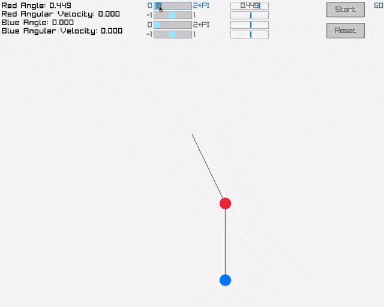

# Double Pendulum Simulation

Visualize the chaotic motion of a double pendulum system.


## Project Structure:
```bash
DoublePendulum/
├── media/
│ └── demo.gif
├── .gitignore
├── LICENSE
├── double_pendulum.c 
├── makefile
├── raygui.h
├── README.md
├── states.c
└── states.h
```


## How to use the program:
- Select the starting angles and angular velocities.
- Press "Start". The simulation will draw the path followed by both pendulums.
- Press "Reset" to reset the state.




## Requirements:
- [Raylib >= 5.0](https://www.raylib.com/)
- C compiler 
- make

> **Note:** raygui.h is a single-header library needed for the GUI.


## How to build the program:
### - Unix:
```bash
git clone https://github.com/Pablox8/DoublePendulum
cd DoublePendulum
make all
./double_pendulum
```


## How does it work:

The simulation is based on the Lagrangian mechanics derivation for a double pendulum. Because the system is chaotic and has no closed-form analytical solution, the program approximates its behaviour using numerical methods (specifically Runge-Kutta 4th order, RK4).

The state of the system at any given moment is defined by four variables: 

$$
Y = \begin{bmatrix} 
\theta_1 \\ 
\omega_1 \\ 
\theta_2 \\ 
\omega_2 
\end{bmatrix}
$$

Where $\theta$ is the angle and $\omega$ is the angular velocity for each pendulum.

To find the next state, the program calculates the derivatives of the values in $Y$, which acts as the mathematical function $f(t, Y)$ for RK4:

$$
\dot{Y} = f(t, Y) = \begin{bmatrix} 
\omega_1 \\ 
\alpha_1 \\ 
\omega_2 \\ 
\alpha_2 
\end{bmatrix}
$$

Where $\alpha$ is the angular acceleration for each pendulum.

The program uses Runge-Kutta 4th Order (RK4) instead of the standard Euler method because it is too imprecise for chaotic systems. It samples the derivatives at four different points within a single time step.

$$k_1 = f(t_n, Y_n)$$
$$k_2 = f(t_n + \frac{h}{2}, Y_n + k_1\frac{h}{2})$$
$$k_3 = f(t_n + \frac{h}{2}, Y_n + k_2\frac{h}{2})$$
$$k_4 = f(t_n + h, Y_n + hk_3)$$

The final state is the weighted average of these slopes:

$$Y_{n+1} = Y_n + \frac{h}{6}(k_1 + 2k_2 + 2k_3 + k_4)$$

Where $h$ (referred to as $dt$ in the code) is the step-size . In this simulation, $h = \frac{1}{60}$ to match the 60 FPS refresh rate set.

> **Note:** the program runs 5 steps per frame, so it's exactly 5 RK4 steps per frame, therefore $h = \frac{1}{300}$.


## Sources used:
- University of Sydney - ["The Double Pendulum"](https://www.physics.usyd.edu.au/~wheat/dpend_html/) by Dr. Mike Wheatland
- ScienceWorld Wolfram - ["Double Pendulum"](https://scienceworld.wolfram.com/physics/DoublePendulum.html)
- Wikipedia - ["Runge-Kutta methods"](https://en.wikipedia.org/wiki/Runge%E2%80%93Kutta_methods)